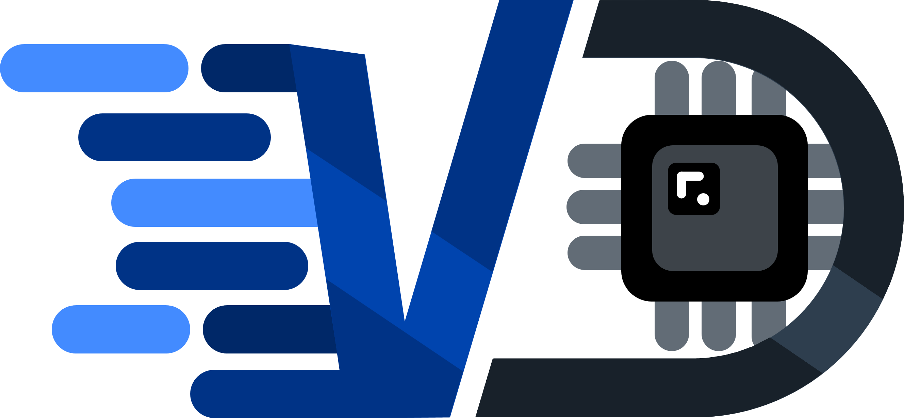
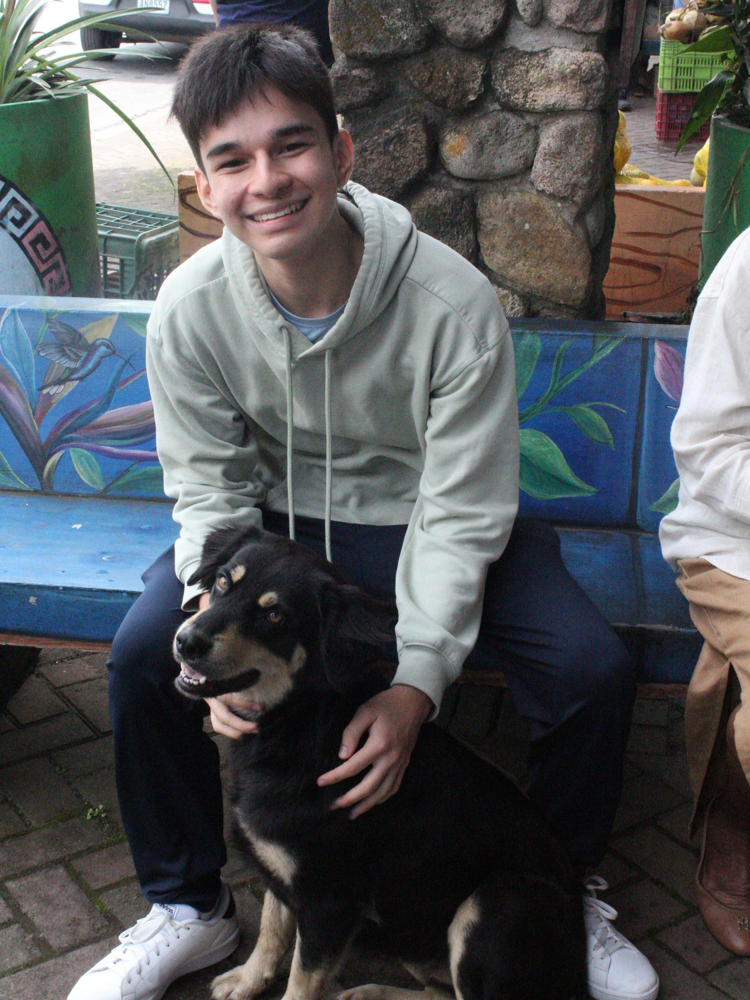
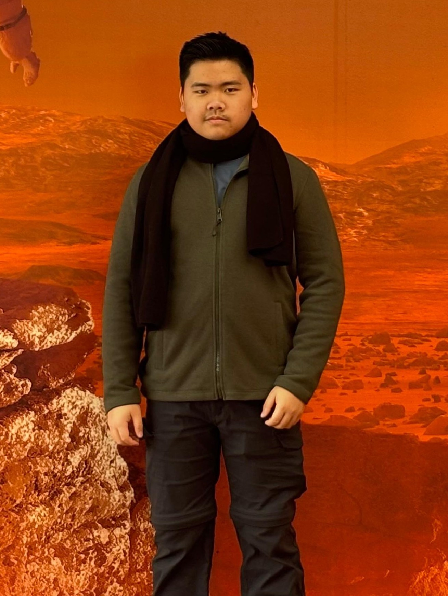
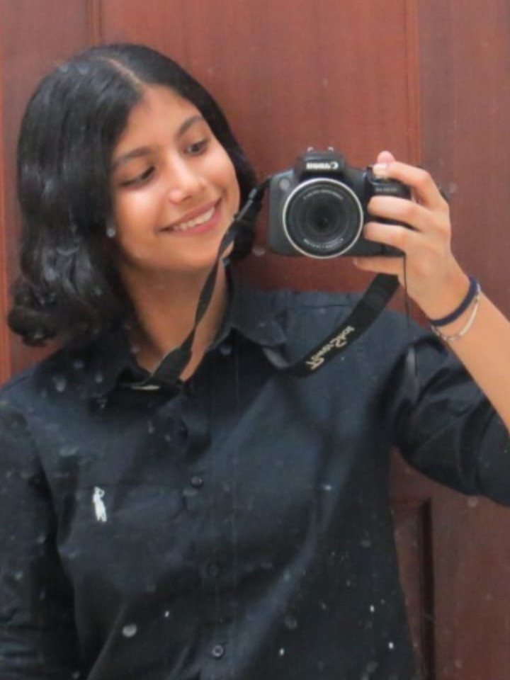

# WRO-Vizdrive-2025

Welcome to the project repository for the **Panamanian 🇵🇦 Team VizDrive** for the **World Robot Olympiad (WRO)** 2025!
Here you will find all the documentation, source code, images, and models related to our autonomous robot.

## Project Summary

VizDrive is an autonomous robot designed to navigate a closed-loop circuit, maintaining a stable trajectory with gyroscopic correction. It uses artificial vision, in conjunction with ultrasonic and color sensors, to detect walls and avoid obstacles.

.jpg)

We are participating in the **Future Engineers Category** to develop our skills and demonstrate the capabilities of young Panamanians in a competitive field like robotics.

---

## General Project Index

You can use this index to navigate through our robot's documentation. Each document provides detailed information on every aspect of its operation:

* [**1. General Project Overview**](./docs/01_project_overview.md)
  * General and concise introduction to the robot and its main components.
  * Describes the robot's operational phases and workflow diagram.
* [**2. Hardware and Components of the Robot**](./docs/02_hardware_components.md)
  * Detailed specifications of all integrated electronic and mechanical hardware.
  * [General Electromechanical Diagram](./schemes/electromechanical_diagram.png)
  * [Circuit Interactive Design (Cirkit)](https://vizdrive.github.io/VizDrive_WRO2025/embeds/interactive_circuit)
* [**3. Software Architecture**](./docs/03_software_architecture.md)
  * Overview of software libraries, core functionalities, and code structure.
  * [Autonomous Driving Code](./src/main_control/Vizdrive_WRO_code.ino)
* [**4. Sensors and Pin Configuration**](./docs/04_sensors_and_pin_configuration.md)
  * In-depth review of each sensor, its role in the functionality, and Arduino pin assignments.
  * [Sensors Test Codes](./src/test_code/)
* [**5. Robot Mobility Functionality**](./docs/05_robot_mobility.md)
  * Focuses on the robot's motion system, motor configuration, and steering mechanisms.
* [**6. PID Control for the Gyroscope**](./docs/06_pid_gyroscope_control.md)
  * Explains the MPU gyroscope implementation and PID control for trajectory stability.
  * [MPU Calibration Code](./src/main_control/mpu_orientation_control/mpu_calibration)
  * [MPU Calibration Data Graph](./assets/data_graphs/mpu_calibration_graph.png)
* [**7. Computer Vision Functions with PixyCam 2.1**](./docs/07_pixycam_computer_vision.md)
  * Covers the PixyCam's vision-based obstacle evasion.
  * [Computer Vision Code](./src/computer_vision/pixycam_functions.ino)
* [**8. Ultrasonic Distance Sensing**](./docs/08_ultrasonic_distance_sensing.md)
  * Covers the distance measurement and wall avoidance with ultrasonic sensors, and the filters implemented to adjust precision.
  * [Ultrasonic Sensor Data Analysis](./assets/data_graphs/Ultrasonic%20Sensors%20Data%20Analysis.xlsx)
* [**9. Color Detection Functions**](./docs/09_color_detection.md)
  * Explains the color sensor's applications and calibration.
* [**10. 3D Modeling and Fabrication**](./docs/10_3d_modeling.md)
  * Details the 3D design process, mechanical characteristics, and fabrication parameters.
  * [3D Models STL](./models/)
* [**11. Other Resources and Documentation**](./docs/11_other_resources.md)
  * Summarized documentation and additional relevant resources and materials.

---

## Photos and Videos

* **Team Photos:** [View Photos](./t-photos/)
* **Vehicle Photos:** [View Photos](./v-photos/)
* **Demonstration Video:** [View Video](./video/driving_demonstration.md)

---

## Source Code

All control and test codes are located in the `src/` folder.

* [Autonomous Driving (Obstacle Avoidance)](./src/main_control/Vizdrive_WRO_code.ino/)
* [Autonomous Driving (No Obstacle Avoidance)](./src/main_control/no_obstacle_avoidance.ino/)
* [MPU Orientation Control (PID and Calibration)](./src/mpu_orientation_control/)
* [Computer Vision (PixyCam 2.1)](./src/computer_vision/computer_vision.ino/)
* [Sensor Test Codes](./src/test_code/)

---

## 3D Models

Files for 3D printed components are located in the `models/` folder in `.stl` files.
To access interactive models of each component, hosted in GitHub pages, visit `embeds/`.

* [Robot 3D Models](./models/)
* [Interactive 3D Models](https://vizdrive.github.io/VizDrive_WRO2025/embeds/)

---

## Diagrams and Graphs

Flowcharts, circuits, and relevant data graphs.

* [Operation Flowchart](./assets/flowcharts/flowchart.png)
* [Calibration Data Graphs](./assets/data_graphs/)
* [Additional Hardware Photos](./assets/hardware_photos/)

---

## Team Members 🙋‍♂️🙋🙋‍♀️

|                                                       |                                                              |                                                        |
|:-----------------------------------------------------:|:-----------------------------------------------------------:|:-------------------------------------------------------:|
|        |               |           |
| **ALEXIS PALACIOS NG**   *Software Engineer*   Sensor Integration, Firmware Architecture, Code Logic, Error Management, Data Analysis, GitHub Repository | **CARLO HO NG**   *Hardware Engineer*   Construction, Wiring, Circuit and PCB Design, Power Management, 3D Modeling and Planning, Logo and Animation | **AISLINN CHAWLA ARORA**   *Logistics and Assistance*   Photography, Competition Planning, Drafting, Social Media |
