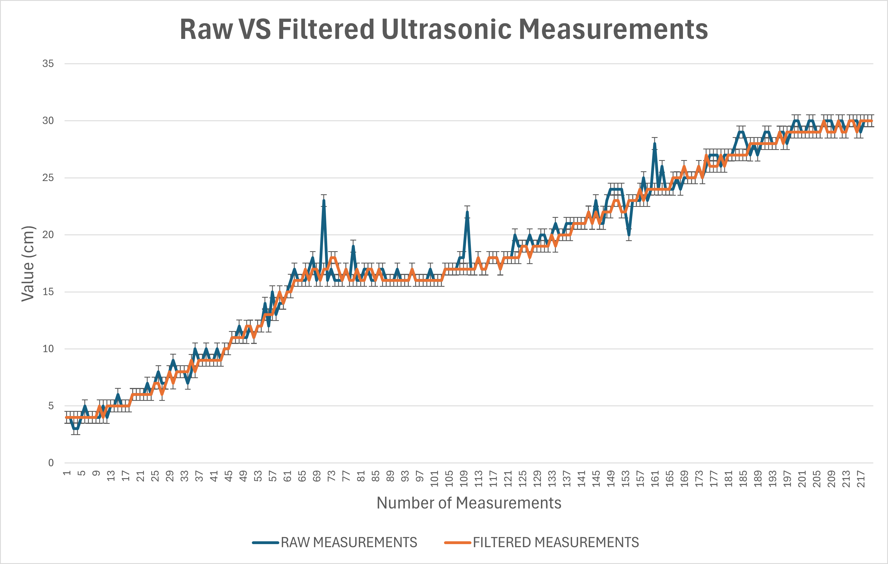

# Data Graphs

This folder refers to the data graphs of out sensor suite calibration.

## MPU6050 Calibration and Data Analysis

The MPU6050 gyroscope + accelerometer is calibrated with live sample readings, to being able to adapt no any environment.
It calculates the average of 250 samples measured when the robot is static, averaging out the bias. This offset is subtracted from all subsequent raw readings for accuracy.
The data recolection, shows that **250** samples is enough to achieve a precision of ±0.01, which is enough for the robot's functionality.

For more information on the MPU6050 control logic and calibration, refer to: [6. PID and Gyroscope Control for Orientation](./../../docs/06_pid_gyroscope_control.md)

## Ultrasonic Sensors Filter Control and Data Analysis

HC-SR04 ultrasonic sensors always present a certain level of noise when collecting many measurements consecutively.
Our robot needs to avoid outliers to maintain a consistent performance. Even one measurement that deviates from what is expected could cause the robot to stop operating properly.

To prevent this malfunction, two filters are implemented for ultrasonic sensors: an outlier filter (similar to a median filter) and a filter to ignore very distant or very close values.
The graph shows how the error dispersion changes when applying our filter to an ultrasonic sensor, measuring the same length.

For more information on the Ultrasonic Sensor suite, refer to: [8. Ultrasonic Distance Sensing](./../../docs/08_ultrasonic_distance_sensing.md)
