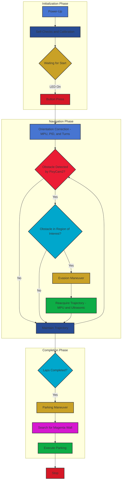

# 1. Project Overview

## 1.1 Introduction to VizDrive 2025

VizDrive is an autonomous robot developed by a Panamanian 🇵🇦 Team for the **2025 World Robot Olympiad (WRO)**.
Our project participates in the **Future Engineers** category. Our goal is to apply advanced robotics, data analysis, error management, and optimization principles to represent Panama in the international field of robotics.

The primary objective of VizDrive is to autonomously navigate a predefined closed-loop circuit, and to detect and evade obstacles. This is achieved using a combination of artificial vision for obstacle detection, and an array of sensors for decision-making. Every single part of the robot is designed, optimized, and constructed by the VizDrive Team; accordingly, we detail all the information in this GitHub repository.

## 1.2 Main Components

| Component | Function |
| ---------------- | ------------------------------------------------------------------------------------------------------------------------ |
| **DC Motor** | Employed for rear-wheel drive (RWD) propulsion. |
| **Wheel Encoder** | Measures the rotational pulses per revolution (PPR) of the wheels, used for odometry and precise maneuvers. |
| **Servo Motor** | Utilized for steering control of the front wheels. |
| **PixyCam 2.1** | Responsible for obstacle recognition and color-based detection. |
| **Ultrasonic Sensors** | Measures real-time distance to walls, used for turns and collision avoidance. |
| **MPU Gyroscope with PID Control** | Provides continuous orientation data, which is processed by a Proportional-Integral-Derivative (PID) controller, to ensure stable and straight trajectory. |
| **Color Sensors** | Employed for detecting specific colored lines or markers on the circuit, signaling turns or parking zones. |

Each of these parts have their own separated document, delving into their calibration, common errors, logic and function in the robot.

---

## 1.3 Main Operational WorkFlow

The robot's operation can be divided into three phases:

### 1. **Initialization Phase (Setup):**

* **Power-Up**, **Self-Checks** and **Calibration:** upon power-up, the robot ensures all sensors and actuators are operational, and calibrates the MPU gyroscope yaw angle for orientation.
* **Waiting for Start:** when the robot is ready for operation a LED indicator illuminates to signal readiness, and the program starts upon a button press.

### 2. **Autonomous Navigation Phase:**

This is the primary operational phase, a loop where the robot continuously checks and adapts to its environment:

* **Orientation Correction (Continuous):**
  * The **MPU-6050** provides real-time orientation data
  * This data is fed into a dedicated PID (Proportional-Integral-Derivative) controller, which compensates for any rotational drift, ensuring the robot maintains a stable and straight heading throughout its trajectory.
* **Obstacle Detection and Evasion (Conditional):**
  * While maintaining trajectory, the **PixyCam 2.1** constantly scans the path ahead for obstacles.
  * If an obstacle is detected within the predefined **Region of Interest (ROI)** of the camera's field of view.
    * **Evasion Maneuver:** the robot turns until the obstacle is no longer detected within the PixyCam's ROI. In conjunction, the front diagonal ultrasonic sensors may detect a short distance to a wall.
    * **Re-acquisition of Trajectory:** following an evasion maneuver, the robot re-establishes its MPU-based trajectory correction. Concurrently, side ultrasonic sensors are utilized to assist in re-centering the robot on its intended path.

### 3. **Completion Phase:**

* The robot transitions to this phase after completing the required number of laps.
  * **Parking Maneuver:** the robot initiates a search for designated magenta walls that define the parking lot. Upon detection, it executes a pre-calculated parking maneuver to conclude the mission.

---

## 1.4 Workflow Diagram

Made with Mermaid for GitHub. Visit [Workflow Diagram.png](./../assets/flowcharts/flowchart.png) if distorted or not seen.

[Back to Main README.md Index](../README.md)
