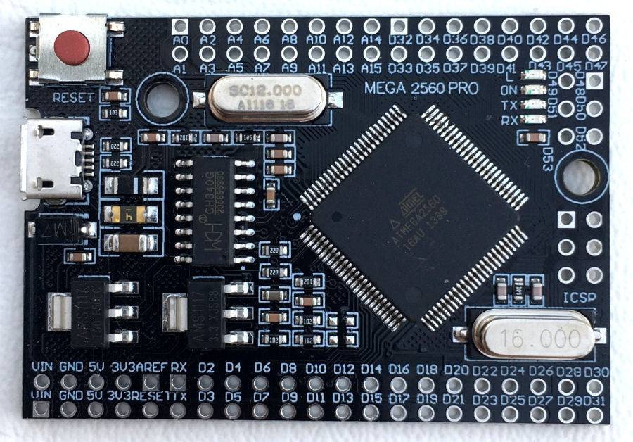
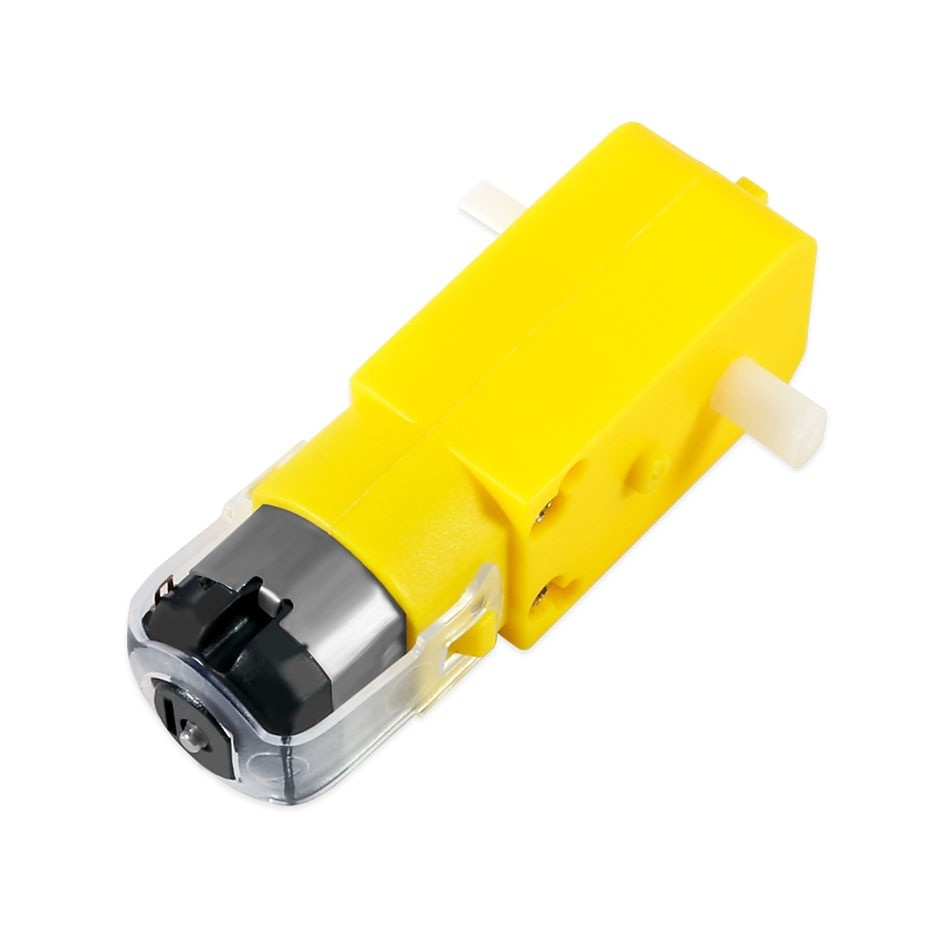
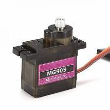
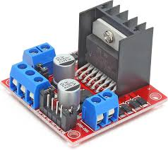
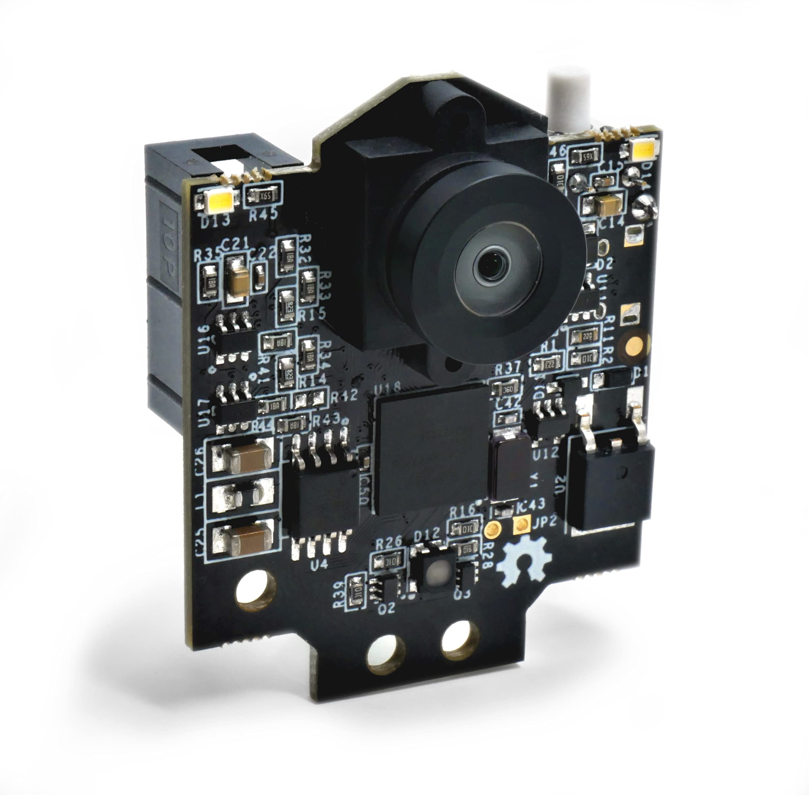
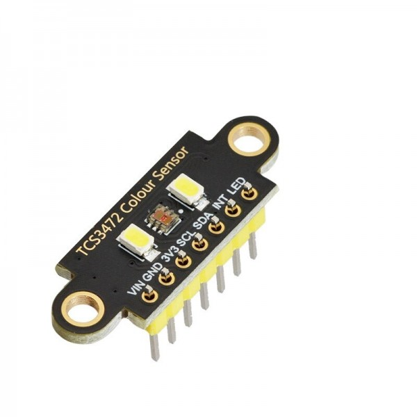
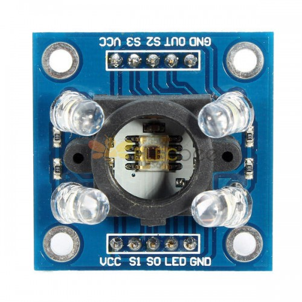
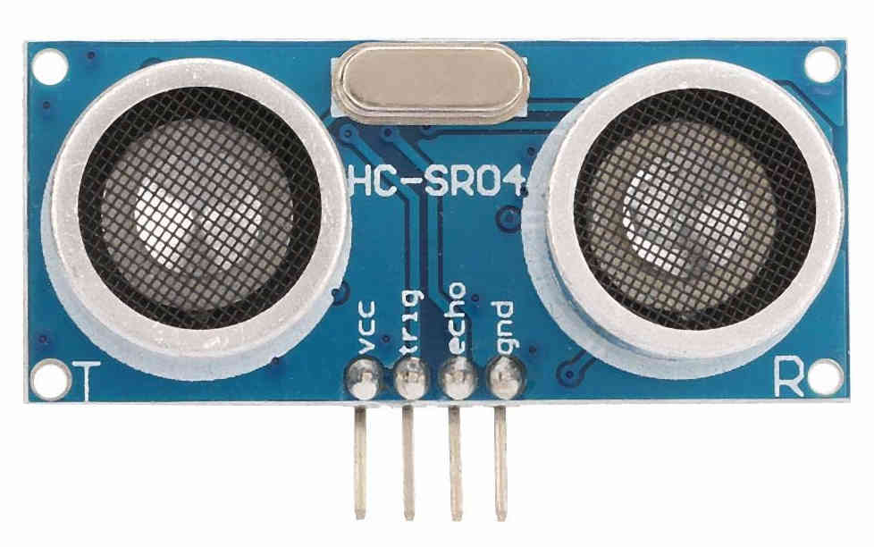
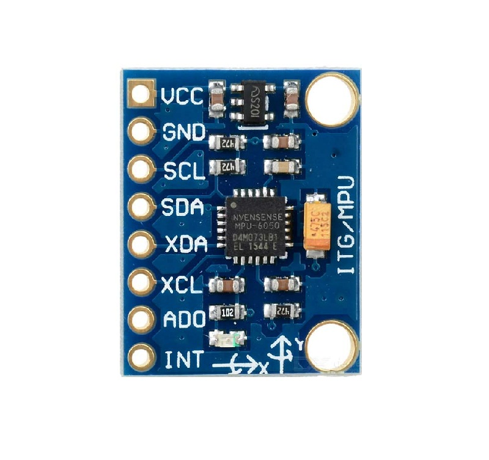
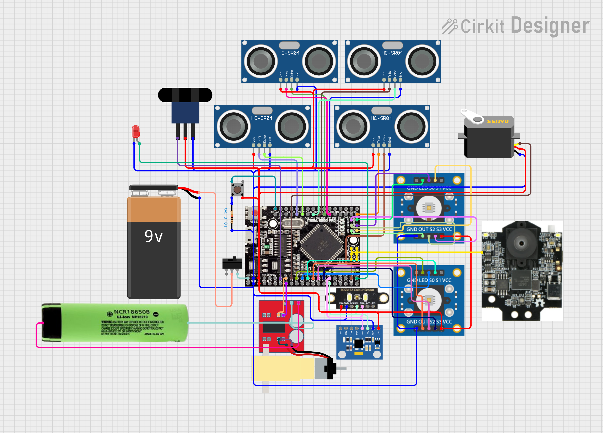

# 2. Robot Hardware and Components

This section provides a detailed enumeration and description of all hardware components integrated into the robot and their specifications.

## 2.1 Main Control and Processing Unit

### **Component:**  **MEGA 2560 Pro Embed**

* **Quantity:** 1
* **Voltage:** 5V (operating), 7-9V (Vin)
* **Description:** Serves as the main controller board, based on the ATmega2560 microcontroller. It processes all sensor data, executes control algorithms, and manages actuation.
* **Features:** 54 digital I/O pins, 16 analog inputs, 256 KB flash memory, and 16 MHz clock speed.

## 2.2 Motion System Components

### **Component:** **Hobby Gearmotor with 48:1 gearbox**

* **Quantity:** 1
* **Voltage Range:** 3-12V (operating at ~3.7V)
* **Current Consumption** ~120 mA
* **Stall Torque:** ~1.5 kg·cm (0.15 N·m)
* **Stall Current:** ~1.6 A
* **Description:** A brushed DC motor with an integrated gearbox for increased torque. Utilized for rear-wheel propulsion.

### **Component:** **Servo Motor MG90S**

* **Quantity:** 1
* **Voltage Range:** 4.8-6V
* **Current Consumption:** ~250 mA (max)
* **Torque:** 1.8 kg·cm @ 5V (0.18 N·m)
* **Description:** A micro servo motor employed for front-wheel steering. Operates via PWM signal.

### **Component:** **Mini L298N Motor Driver**

* **Quantity:** 1
* **Logic Voltage:** 5V
* **Motor Voltage Range:** Up to 12V
* **Current Output:** Up to 2A per channel
* **Description:** A dual H-bridge motor driver responsible for interfacing the low-current control signals from the Arduino Mega to the higher-current requirements of the DC motors.

## 2.3 Sensor Suite

### **Component:** **PixyCam 2**

* **Quantity:** 1
* **Voltage:** 5V
* **Current Consumption:** ~140 mA
* **Interface:** ICSP
* **Description:** Smart vision sensor for real-time color and object recognition. Used for obstacle detection.

### **Component:** **TCS3472 Color Sensor**

* **Quantity:** 1
* **Voltage:** 3.3-5V
* **Current Consumption** ~235 µA (active)
* **Interface:** I2C
* **Description:** High-resolution color sensor with IR filtering. Mounted underneath the robot to detect blue and orange floor lines that indicate turns.

### **Component:** **TCS3200 Color Sensor**

* **Quantity:** 2
* **Voltage:** 2.7-5.5V
* **Power Consumption:** ~10-50 mA
* **Output:** Frequency proportional to color intensity
* **Description:** Side-mounted color recognition sensors used for detecting the magenta signal for parking. Converts color input to frequency output.

### **Component:** **HC-SR04 Ultrasonic Sensors**

* **Quantity:** 4
* **Voltage:** 5V
* **Current Consumption:** ~15 mA
* **Range of Detection:** ~2 cm to ~4 m
* **Description:** Distance sensors placed at the front and rear utilized for measuring real-time distances to walls, used for collision avoidance and maintaining orientation.

### **Component:** **MPU6050 Accelerometer + Gyroscope**

* **Quantity:** 1
* **Voltage:** 3.3-5V
* **Current Consumption:** ~3.8 mA
* **Interface:** I2C
* **Description:** A 3-axis MPU providing acceleration and angular velocity data, used for angle correction and maintaining trajectory stability through PID control.

### **Component:** **Infrared Optocoupler Encoder**

* **Quantity:** 1
* **Voltage:** 3.3-5V
* **Current Consumption:** <20 mA
* **Description:** A laser interruption-based encoder used for detecting rotational position, enabling accurate measurement of distance and speed (odometry).

## 2.4 Power Supply and Regulation

### **Component:** **3.7V batteries**

* **Quantity:** 2
* **Voltage:** 3.7V nominal
* **Capacity:** 5000 mAh
* **Discharge Current:** Up to 2A (depending on model)
* **Description:** Power supply for the robot's DC motors. Specifically, **Li-ion 18650 Battery 3.7V 5000 mAh** is used.

### **Component:** **Rechargable 9V Battery**

* **Quantity:** 1
* **Voltage:** 9V nominal
* **Capacity:** ~600 mAh
* **Description:** A standard 9V battery used for the sensors and Arduino MEGA unit.

## 2.5 Miscellaneous Components

### **Component:** **Custom Chassis (RWD)**

* **Quantity:** 1
* **Material:** 3D printed (PLA)
* **Description:** A 3D designed rear-wheel drive chassis designed to house motors, mounts, sensors, battery holders, and the controller.

[Interactive 3D Model of Custom Chassis](https://alexp7608.github.io/VizDrive-pruebas/embeds/interactive_chassis.html)

### **Component:** **Pushbutton**

* **Quantity:** 1
* **Voltage Handling:** Signal-level (logic input)
* **Current:** <10 mA
* **Description:** A momentary switch used to initiate the main program.

### **Component:** **Toggle Switch**

* **Quantity:** 1
* **Voltage Handling:** Up to ~12V
* **Current:** Up to ~500mA
* **Description:** A switch for toggling between two states, serving as the main power switch for the robot.

### **Component:** **LED**

* **Quantity:** 1
* **Forward Voltage:** ~3V
* **Current:** ~10-20 mA
* **Description:** A standard red LED used as a visual indicator, signaling program readiness.

### **Component:** **Resistor**

* **Quantity:** 1
* **Resistance:** 10kΩ
* **Description:** Current-limiting resistor for the pushbutton.

## 2.6 Circuit Design

We developed a custom shield circuit using a Printed Circuit Board (PCB) to streamline the electrical connections, in order to reduce cable clutter, and minimize the overall weight, size, and complexity of the system. All components and routes were manually soldered onto the PCB to ensure a compact and custom integration of all components.

.jpg)

* **Detailed Electromechanical Diagram:** For a more in-depth view of how all electronic and mechanical components are interconnected, refer to the the electromechanical diagram:

You can also visit the detailed interactive visual representation in [Interactive Cirkit Circuit Design](https://alexp7608.github.io/VizDrive-pruebas/embeds/interactive_circuit.html). It's an embedded webpage hosted on GitHub Pages.

---

[Back to Main README.md Index](../README.md)
