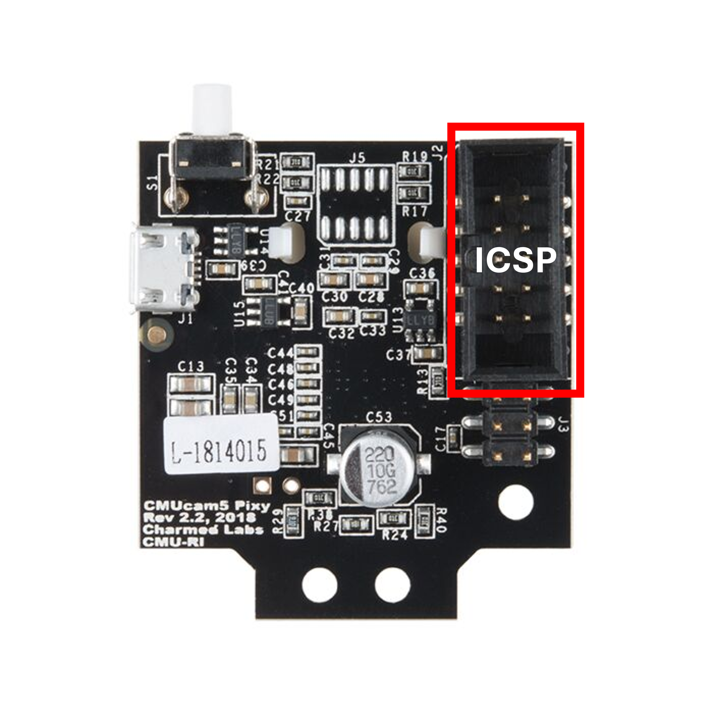

# 4. Sensors and Pin Configuration

This section provides an in-depth look at each sensor integrated into our robot, its specific role within the robot's control system, and its precise pin configuration on the Arduino MEGA 2560 pro.

## 4.1 Overview of Pin Configuration

The following table summarizes the primary pin assignments for all the components on the Arduino Mega 2560 Pro:

| Component                    | Arduino Pin (Digital/Analog) | Function                                       |
| :--------------------------- | :--------------------------- | :--------------------------------------------- |
| IR Encoder                   | `D2`                         | Encoder OUT signal                  |
| DC Motor Driver (MX1508)     | `D4`, `D5`                   | IN1, IN2 (for motor control)        |
| Servo Motor (SG90)           | `D6`                         | Servo control signal                |
| Ultrasonic Front-Left        | `D37` (Trigger), `D35` (Echo) | Distance measurement                |
| Ultrasonic Front-Right       | `D33` (Trigger), `A15` (Echo) | Distance measurement                |
| Ultrasonic Left              | `A9` (Trigger), `A11` (Echo) | Distance measurement                 |
| Ultrasonic Right             | `D47` (Trigger), `D28` (Echo) | Distance measurement                |
| PixyCam 2.1                    | SPI Interface (Default)      | Communication (MISO, 5V, SCLK, MOSI, RESET, GND) |
| MPU6050                      | I2C (SDA: `D20`, SCL: `D21`) | Accelerometer + Gyroscope data |
| Bottom Color Sensor (I2C)    | I2C (SDA: `D20`, SCL: `D21`) | Floor color recognition        |
| Left Color Sensor (TCS3200)  | `D51`, `D49`, `D50`, `D52` (S0, S1, S2, S3), `D48` (OUT) | Side color recognition         |
| Right Color Sensor (TCS3200) | `D10`, `D8`, `D16`, `D14` (S0, S1, S2, S3), `D18` (OUT) | Side color recognition          |
| Pushbutton                   | `A0`                         | Start program trigger              |
| LED Indicator                | `D46`                        | Program readiness signal           |

**For the circuit design and electromechanical diagram:**

* [General Electromechanical Diagram](../schemes/)
* [Circuit Design (Cirkit)](https://alexp7608.github.io/VizDrive-pruebas/embeds/interactive_circuit.html)

## 4.2 Detailed Sensor Information and Pin Configuration

### Ultrasonic Sensors (HC-SR04)

* **Functionality:** Operates on echolocation principles, emitting an ultrasonic pulse and measuring the time for its return echo to calculate distance. Used for obstacle avoidance.
* **Role:** Four sensors are strategically placed:
  * **Front-Left & Front-Right:** Primary for detecting short distances to walls during evasion.
  * **Left & Right:** Used post-evasion to assist in re-centering the robot on its trajectory.
* **Pin Configuration:**
  * `VCC`: Connected to Arduino `5V`.
  * `GND`: Connected to Arduino `GND`.
  * `TRIG` & `ECHO`: Connected to specific digital/analog pins as per the summary table.
* **Library:** Utilizes the `NewPing` library for efficient sensor management.

### Infrared Optocoupler Encoder

* **Functionality:** Detects pulses generated by the encoding wheel as an interrupt on the Arduino. Essential for accurate odometry (distance and speed measurement).
* **Pin Configuration:**
  * `OUT`: Connected to Arduino Mega `D2` (configured with `attachInterrupt` for `RISING` edge detection).
  * `VCC`: Connected to Arduino `5V`.
  * `GND`: Connected to Arduino `GND`.
* **Key Parameters:** Pulses per revolution (PPR) is `16.0`. Wheel circumference is `22.0` cm.

For the main documentation on **Encoder and Mobility:**
[Robot Mobility Functionality](./05_robot_mobility.md)

### MPU6050 Accelerometer + Gyroscope

* **Functionality:** A 3-axis Inertial Measurement Unit (IMU) that provides linear acceleration (accelerometer) and angular velocity (gyroscope) data. The gyroscope's Z-axis (yaw) readings are used for detecting and correcting rotational drift.
* **Role:** Provides continuous orientation data, which is fundamental input for the PID control loop used to correct unwanted rotational drift and maintain a stable heading.
* **Pin Configuration:** Communicates via I2C protocol.
  * `VCC`: Connected to Arduino `5V`.
  * `GND`: Connected to Arduino `GND`.
  * `SCL`: Connected to Arduino Mega `D21`.
  * `SDA`: Connected to Arduino Mega `D20`.
* **Library:** Utilizes the `Adafruit_MPU6050` and `Adafruit_Sensor` libraries.

For the main documentation on **MPU Gyroscope and PID Control:**
[**PID Control for the Gyroscope**](./06_pid_gyroscope_control.md)

### PixyCam 2.1

* **Functionality:** A fast vision sensor that performs on-board image processing to detect objects based on pre-trained color signatures. It reports object data (x, y position, width, height) to the microcontroller.
* **Role:** Key for vision-based obstacle evasion. Detects red objects to initiate evasion to the right, and green objects to evade to the left.
* **Pin Configuration:** Communicates via SPI interface (default).
  * `MISO`, `5V`, `SCLK`, `MOSI`, `RESET`, `GND`: Connected to the PixyCam 2.1 ISCP.
* **Library:** Utilizes the `Pixy2` library for integration.

For the main documentation on **Computer Vision with PixyCam2:**
[**Computer Vision Functions with PixyCam2**](07_pixycam_computer_vision.md)

### Color Sensors (TCS3472 & TCS3200)

* **Functionality:** These sensors detect the color of a surface by measuring the intensity of reflected light across different color filters (Red, Green, Blue).
* **Role:**
  * **TCS3472 (Bottom):** Placed at the robot's base to detect *blue* and *orange* lines on the mat, signaling specific turning points.
  * **TCS3200 (Sides):** Two sensors located on the sides. Their primary role is for detecting a *magenta* signal for the final parking maneuver.
* **Pin Configuration (TCS3472 - I2C):**
  * `VCC`, `GND`: Connected to Arduino `5V` and `GND` respectively.
  * `SCL`, `SDA`: Connected to Arduino Mega `D21` and `D20` respectively (I2C bus).
* **Pin Configuration (TCS3200 - Side Sensors):**
  * `VCC`, `GND`: Connected to Arduino `5V` and `GND`.
  * `S0`, `S1`, `S2`, `S3`, `OUT`, `LED`: Connected to specific digital pins as per the summary table.
* **Library:** Utilizes `Adafruit_TCS34725` for the I2C color sensor.

For the main documentation on **Color Sensors and Calibration:**
[**Color Detection Functions**](./docs/08_color_detection.md)

---

[Back to Main README.md Index](../README.md)
