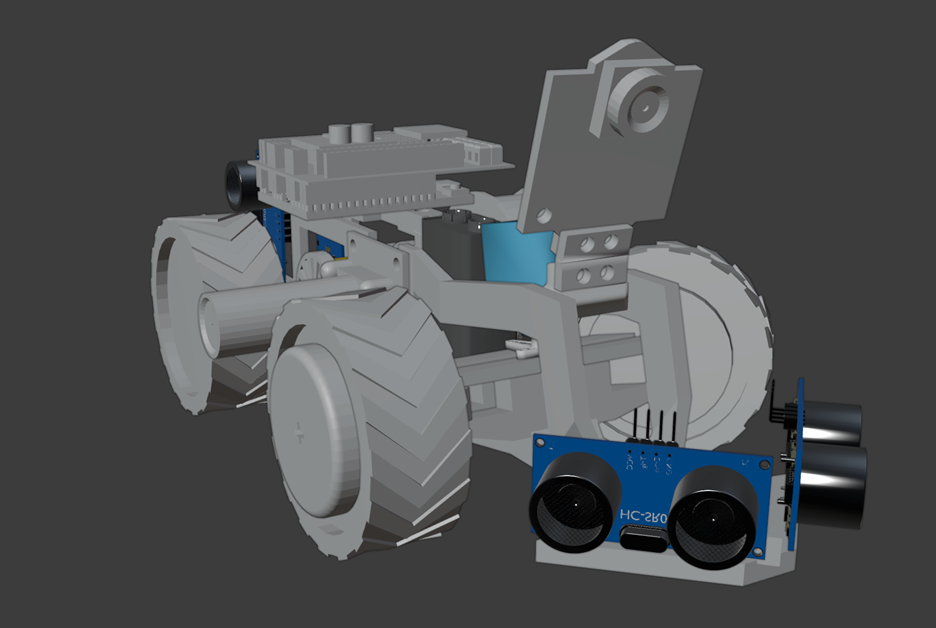

# 5. Robot Mobility

This section provides an in-depth analysis of VizDrive's mobility system, covering mechanical design considerations, motor and steering configurations, and the software module responsible for locomotion.

---

## 5.1 Mechanical Design for Mobility

VizDrive's mechanical design prioritizes precise and stable locomotion, integrating specific features to optimize performance.

* **Rear-Wheel Drive (RWD) Configuration**: The robot utilizes a RWD setup where a single DC motor drives the rear wheels via a solid axle. Front-wheel steering is achieved through a servo-controlled mechanism.
  * **Propulsion Motor**: A **Hobby Gearmotor with a 48:1 gearbox** is employed for the rear drive, selected for its ample torque suitable for various terrains.
  * **Steering Actuator**: A **Servo Motor SG90** is used to precisely control the angular position of the front steering wheels.
 


* **Light Frame Chassis**: The chassis is engineered as a lightweight beam structure. This compact design enhances driving precision and overall durability.


* **Tolerance Management**: Strategic variations in manufacturing tolerances were applied during part design:
  * **Snug Fit**: Components secured by screws are designed for a tight fit to ensure rigidity.
  * **Higher Tolerance**: Wheel and steering mechanisms incorporate greater tolerance. This allows for slight movement, reducing friction, and inadvertently contributes to a degree of passive suspension, which helps in accommodating minor ground irregularities and improving stability.


* **Caster Angle**: To mitigate any inherent imprecision arising from steering tolerances, a **caster angle of 10°** has been implemented. This geometric arrangement naturally biases the steering wheels to return to a centered, straight-ahead position, improving straight-line tracking stability.


* **Steering Angle Capability**: The steering system is designed to achieve a **35-degree turn in each direction**. This range enables sharp maneuvers, including specialized actions like parallel parking.


* **Screw Orientation**: Screws used in critical drivetrain assemblies are oriented to self-tighten as the robot moves forward. This design detail prevents screws from loosening and wheels from detaching due to friction, a particularly important consideration for 3D-printed hub designs that offer bidirectional screw orientation options.


---

## 5.2 Software Mobility Module

The `movement.cpp` module contains the core functions that govern VizDrive's locomotion, abstracting motor and steering control.

### Hardware Definitions

The following preprocessor definitions specify the Arduino pins connected to the motor driver, servo, and encoder:

```cpp
#define MOTOR_INA_PWM 4 // PWM pin for motor INA (DC Motor Driver)
#define MOTOR_INB_PWM 5 // PWM pin for motor INB (DC Motor Driver)
#define SERVO_PIN 6     // Pin for the steering servo motor
#define ENCODER_PIN 2   // Digital pin for the quadrature encoder interrupt
```

### Global Variables and Constants

* **`motorSpeed`**: `const int motorSpeed = 150;` (Defined in `main.ino`) - The default PWM value (0-255) for consistent motor speed during standard operations.
* **`steeringServo`**: `Servo steeringServo;` - The object representing the steering servo motor.
* **`encoderPulseCount`**: `volatile unsigned long encoderPulseCount = 0;` - A volatile counter that increments with each pulse from the encoder wheel, tracking distance traveled.
* **`PARKING_PULSES`**: `static const unsigned long PARKING_PULSES = 200;` - The target number of encoder pulses required for the precise distance of the parking maneuver. This value is calibrated empirically.

### Steering Angle Constants

These constants define the safe operational range for the steering servo:

```cpp
const int SERVO_STRAIGHT = 85; // Servo angle for straight-ahead motion
const int SERVO_MAX = 35;      // Maximum angular deflection from SERVO_STRAIGHT
const int SERVO_LEFT = SERVO_STRAIGHT - SERVO_MAX; // Minimum servo angle for extreme left turn (e.g., 50 degrees)
const int SERVO_RIGHT = SERVO_STRAIGHT + SERVO_MAX; // Maximum servo angle for extreme right turn (e.g., 120 degrees)
```

### Functions

#### `void driveForward(int speed)`

* **Purpose**: Engages the rear DC motors for forward propulsion.
* **Parameters**:
  * `speed`: An integer PWM value (0-255) that directly controls the motor's power and speed.
* **Operation**:
  * `analogWrite(MOTOR_INA_PWM, speed);`: Applies the specified PWM signal to control motor power.
  * `digitalWrite(MOTOR_INB_PWM, LOW);`: Sets the direction pin to `LOW` for forward movement.

#### `void driveBackward(int speed)`

* **Purpose**: Activates the rear DC motors to move the robot in reverse.
* **Parameters**:
  * `speed`: An integer PWM value (0-255) for backward motor power.
* **Operation**:
  * `analogWrite(MOTOR_INA_PWM, LOW);`: Sets the INA pin to `LOW`.
  * `digitalWrite(MOTOR_INB_PWM, speed);`: Applies the PWM signal to the INB pin, establishing the backward direction. This function is specifically utilized for controlled reverse maneuvers, such as during the parking sequence.

#### `void stopMotors()`

* **Purpose**: Deactivates the DC motors, allowing the robot to decelerate naturally.
* **Operation**:
  * `digitalWrite(MOTOR_INA_PWM, LOW);`
  * `digitalWrite(MOTOR_INB_PWM, LOW);`
        This method provides a gentle stop, reducing mechanical stress compared to an abrupt brake.

#### `void stopBrake()`

* **Purpose**: Implements an immediate and forceful braking action for the DC motors.
* **Operation**:
  * `digitalWrite(MOTOR_INA_PWM, HIGH);`
  * `digitalWrite(MOTOR_INB_PWM, HIGH);`
        By setting both motor input pins to `HIGH`, a short-circuit braking effect is achieved, resulting in a rapid stop. This is typically used for emergency halts or final system shutdown.

#### `void setSteeringAngle(int angle)`

* **Purpose**: Controls the angular position of the front steering wheels using the attached servo motor.
* **Parameters**:
  * `angle`: An integer representing the desired servo position in degrees (0-180).
* **Operation**:
  * `steeringServo.write(angle);`: Sends the `angle` command to the servo using the `Servo.h` library.
* **Safety**: The `angle` value is always constrained by calling functions (e.g., `keepOrientation()`, `handleEvasion()`) to remain within `SERVO_LEFT` and `SERVO_RIGHT` boundaries. This prevents over-rotation and physical interference with the chassis.

#### `void performParking()`

* **Purpose**: Executes a predefined parking maneuver, adapting to the robot's current turning `direction`.
* **Operation**:
    1. `encoderPulseCount = 0;`: Resets the encoder counter to ensure precise distance measurement for the parking sequence.
    2. `int parkingAngle = (direction < 0 ? SERVO_RIGHT : SERVO_LEFT);`: Determines the initial sharp steering angle for parking based on the global `direction` variable. If `direction` is negative (indicating a previous left turn path), the robot steers `SERVO_RIGHT` to initiate parking on the right side, and vice-versa.
    3. `setSteeringAngle(parkingAngle);`: Applies the calculated parking steering angle.
    4. `delay(100);`: A brief pause allows the servo to reach the commanded angle.
    5. **Reverse Maneuver**:

        ```cpp
        while (true) {
            driveBackward(150); // Drive backwards at a moderate speed
            unsigned long cnt = encoderPulseCount;
            if (cnt >= PARKING_PULSES) break; // Exit loop when target pulses are reached
        }
        ```

        The robot drives backward until the `encoderPulseCount` matches `PARKING_PULSES`, signaling that the required reverse distance has been covered.
    6. **Straighten Steering**: After reversing, the steering servo is returned to `SERVO_STRAIGHT` (though not explicitly shown in the provided snippet, it would follow the `while` loop for final alignment).

#### `void encoderISR()`

* **Purpose**: This is an Interrupt Service Routine (ISR) designed to detect pulses from the quadrature encoder attached to the drivetrain.
* **Operation**:
  * `encoderPulseCount++;`: Increments the `encoderPulseCount` variable every time a rising edge is detected on the `ENCODER_PIN`. This ISR is attached to the hardware interrupt for `ENCODER_PIN`, ensuring highly accurate pulse counting for distance measurement.

---

[Back to Main README.md Index](./../README.md)
