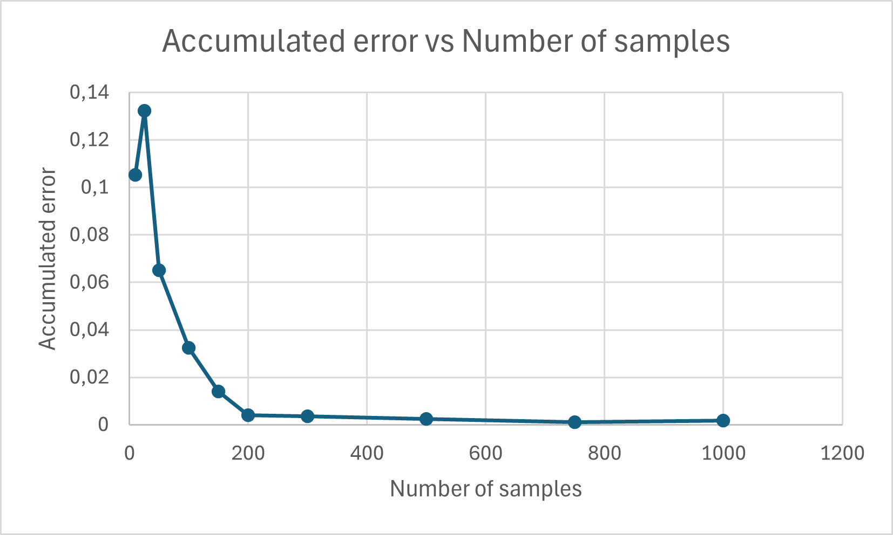

# 6. Orientation Control

This section provides an in-depth explanation of VizDrive's orientation control system, focusing on the Proportional-Derivative (PD) control loop, MPU6050 gyroscope integration, and the critical calibration process. Maintaining a stable and precise trajectory is fundamental for VizDrive's performance in the WRO circuit.

---

## 6.1 MPU6050 Gyroscope Integration

The **MPU6050** is a 6-axis motion tracking device that includes both a 3-axis gyroscope and a 3-axis accelerometer. VizDrive primarily utilizes the gyroscope's Z-axis (Yaw) data to determine the robot's real-time angular velocity and subsequently its orientation.

### Global Object and Variables

```cpp
Adafruit_MPU6050 mpu; // MPU6050 sensor object
static float yaw = 0.0; // Current accumulated yaw angle of the robot (in degrees)
float gyroZ_offset = 0.0; // Z-axis gyroscope offset for calibration (in degrees/second)
```

### Initialization (`void initOrientation()`)

* **Purpose**: Initializes the MPU6050 sensor and performs a crucial calibration step to determine the Z-axis gyroscope's static bias.
* **Operation**:
    1. `Wire.begin();`: Initializes the I2C communication protocol, which the MPU6050 uses.
    2. `if (!mpu.begin()) while (1);`: Attempts to initialize the MPU6050. If initialization fails (e.g., sensor not detected), the program enters an infinite loop.
    3. **Sensor Configuration**:
          * `mpu.setAccelerometerRange(MPU6050_RANGE_8_G);`: Sets the accelerometer's measurement range to ±8g.
          * `mpu.setGyroRange(MPU6050_RANGE_500_DEG);`: Sets the gyroscope's measurement range to ±500 degrees per second, suitable for robot maneuvers.
          * `mpu.setFilterBandwidth(MPU6050_BAND_21_HZ);`: Configures the Digital Low Pass Filter (DLPF) bandwidth to 21 Hz to reduce high-frequency noise.
    4. `delay(100);`: A brief pause to allow sensor stabilization.
    5. **Z-axis Gyroscope Calibration**: This routine calculates `gyroZ_offset`, the average static drift of the gyroscope when the robot is stationary.
          * A loop collects `samples` (e.g., 250) of Z-axis gyroscope data (`g.gyro.z`).
          * The `gyroZ_offset` is computed as the sum of these readings divided by the number of samples, effectively averaging out the bias. This offset will be subtracted from all subsequent raw readings for accuracy.

### Yaw Angle Accumulation (`void updateOrientation(float dt)`)

* **Purpose**: Continuously calculates and updates the robot's current accumulated yaw angle (`yaw`) based on gyroscope data.
* **Parameters**:
  * `dt`: A float representing the time elapsed (in seconds) since the last update, passed from the `loop()` function, ensuring time-based integration.
* **Operation**:
    1. `mpu.getEvent(&a, &g, &temp);`: Retrieves the latest sensor event data, including gyroscope readings (`g`).
    2. `float gyroZ_deg = (g.gyro.z - gyroZ_offset) * 57.2958;`:
          * The raw Z-axis gyroscope reading (`g.gyro.z`) is compensated by subtracting the `gyroZ_offset`.
          * The result (in radians/second) is converted to degrees/second by multiplying by $180 /π$ $\\approx$ $57.2958$.
    3. `if (abs(gyroZ_deg) > 0.1) { yaw += gyroZ_deg * dt; }`:
          * A noise threshold (0.1 degrees/second) is applied. If the angular velocity is below this, it's considered noise and not integrated, preventing drift when the robot is stationary or moving very slowly.
          * Otherwise, the compensated angular velocity (`gyroZ_deg`) is multiplied by the time difference (`dt`) and added to the `yaw` variable, integrating the angular velocity over time to obtain the accumulated angle.

---

## 6.2 Fundamentals of PID Control

A Proportional-Integral-Derivative (PID) controller is a widely used feedback control loop mechanism. It continuously calculates an "error" value as the difference between a desired setpoint (target) and a measured process variable (current state). The controller then attempts to minimize this error by adjusting the process control inputs.

* **P (Proportional) Term**:
  * **Function**: Reacts to the *current* error.
  * **Effect**: Provides the primary driving force for correction. A larger error results in a proportionally larger corrective action.
* **I (Integral) Term**:
  * **Function**: Accounts for *past* errors by summing up instantaneous errors over time.
  * **Effect**: Helps to eliminate any steady-state error (offset) that the proportional term might leave.
* **D (Derivative) Term**:
  * **Function**: Predicts *future* errors based on the *rate of change* of the current error.
  * **Effect**: Helps to dampen oscillations and improve the system's response speed by applying a larger correction when the error is changing rapidly, and a smaller one when it is stabilizing.

---

## 6.3 Application to Yaw Axis Control (PD Control)

VizDrive implements a **Proportional-Derivative (PD) control** scheme to determine the appropriate steering angle for the servo motor. This corrects orientation errors and maintains the robot's intended trajectory.

### Global Variables (PD Specific)

```cpp
static float targetYaw = 0.0; // The desired yaw angle for the robot (in degrees)
static float previousError = 0.0; // Stores the error from the previous control cycle for derivative calculation

// PID error variables (Ki is set to 0, indicating a PD controller)
const float Kp = 1.8; // Proportional gain
const float Kd = 1.2; // Derivative gain
const float Ki = 0.0; // Integral gain (inactive)
```

### `void keepOrientation()`

* **Purpose**: Implements the PD control loop to adjust the steering servo and maintain the `targetYaw`.
* **Operation**:
    1. **Error Calculation**:
          * `float error = targetYaw - yaw;`: Computes the difference between the desired `targetYaw` and the current `yaw`. A positive error means the robot needs to turn in one direction to reach the target, and a negative error means the opposite.
    2. **Derivative Calculation**:
          * `float derivative = error - previousError;`: Determines the rate of change of the error. This term predicts future error and helps to dampen oscillations, improving the system's stability and response time.
    3. **Correction Calculation**:
          * `int correction = SERVO_STRAIGHT + (int)(Kp * error + Kd * derivative);`:
              * `Kp * error`: The proportional component, which scales the correction based on the magnitude of the current error.
              * `Kd * derivative`: The derivative component, which scales the correction based on how rapidly the error is changing.
              * `SERVO_STRAIGHT`: The base angle for the steering servo (neutral position). The calculated PD terms are added to this base to derive the final steering angle.
    4. **Constraint and Actuation**:
          * `correction = constrain(correction, SERVO_LEFT, SERVO_RIGHT);`: Ensures the calculated steering angle remains within the safe and physically achievable limits defined by `SERVO_LEFT` and `SERVO_RIGHT`.
          * `setSteeringAngle(correction);`: Sends the adjusted steering angle to the servo motor.
    5. **Update Previous Error**:
          * `previousError = error;`: Stores the current `error` to be used as `previousError` in the next control cycle for the derivative calculation.

### Exclusion of Integral Term (`Ki = 0`)

The integral term (`Ki`) is set to zero because the control loop operates in very short, real-time intervals. In this context, persistent, cumulative errors are negligible, and the system is highly dynamic. Introducing an integral term, which primarily addresses long-term steady-state errors, would be unnecessary and could introduce instability or over-correction due to wind-up effects.

### PID Constants Tuning

The `Kp` and `Kd` parameters are critical for optimal performance and have been determined empirically:

* `Kp = 1.8`
* `Kd = 1.2`
* `Ki = 0.0` (as explained above, the integral term is not used for yaw control)

These values provide a stable and responsive control loop:

* **`Kp` (Proportional Gain)**: Was adjusted by gradually increasing it until the robot started oscillating around the desired path (indicating overcorrection), then slightly reducing it to achieve a balanced response.
* **`Kd` (Derivative Gain)**: Was tuned after `Kp` to smooth the response, reduce overshoot, and dampen oscillations, leading to a more precise and stable trajectory.

### Target Yaw Management Functions

These functions allow external modules (e.g., `state_logic`) to interact with and query the orientation control system:

* **`void setTargetYaw(float angle_deg)`**:

  * **Purpose**: Sets a new desired `targetYaw` angle for the PD controller to aim for.
  * **Usage**: Critical for executing turns; for example, `handleColorAction()` updates `targetYaw` by adding or subtracting 90 degrees based on the detected turn direction.

* **`float getCurrentYaw()`**:

  * **Purpose**: Returns the robot's current accumulated yaw angle.
  * **Returns**: The `yaw` float value in degrees.
  * **Usage**: Used by `state_logic` to calculate `turnTargetYaw` and evaluate turn completion.

* **`float getYawError()`**:

  * **Purpose**: Returns the difference between the `targetYaw` and the current `yaw`.
  * **Returns**: The error value (`targetYaw - yaw`) in degrees. A positive value indicates the current `yaw` is less than `targetYaw`, and vice versa.
  * **Usage**: Crucial for `state_logic` to determine if a turn has been successfully completed by checking if `abs(getYawError())` is less than `TURN_THRESHOLD`.

---

## 6.4 MPU Calibration Process

Accurate MPU readings are fundamental for effective PID control. A dedicated calibration procedure is performed to account for manufacturing biases and environmental factors.

* **Calibration Code**: A custom calibration code, located at `./../src/main_control/mpu_orientation_control/mpu_calibration.ino`, is used to collect data on the accumulated error from the MPU.

* **Data Collection**: This code collects gyroscope data over a measurement period (e.g., 10 seconds), testing various sample sizes to determine the optimal average correction.

* **Offset Determination**: The `gyroZ_offset` is calculated by averaging gyroscope readings over a set number of samples (e.g., 250 samples) while the sensor is stationary. This offset is then subtracted from subsequent raw gyroscope readings to ensure accurate, bias-corrected measurements.

* **Optimal Sample Size**: Data visualization (as shown in the graph below) indicates that approximately **200-250 samples** are optimal for calibrating the `gyroZ_offset`, as the error reduction becomes insignificant beyond this point, achieving an accuracy of approximately `±0.01`.

* **Data Visualization**:



---

[Back to Main README.md Index](https://www.google.com/search?q=../README.md)
