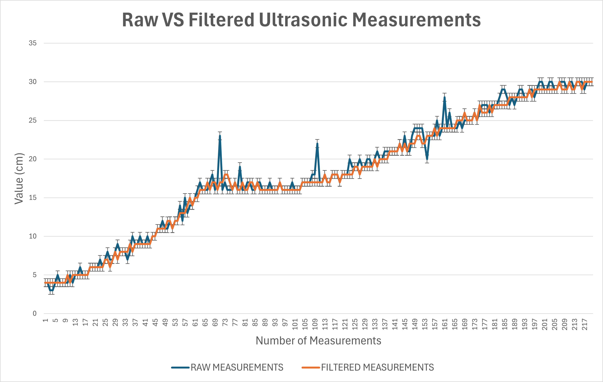

# 8. Ultrasonic Distance Sensing

## 8.1 Ultrasonic Sensors for Distance Detection

While the PixyCam handles vision-based object recognition, **Ultrasonic Sensors** provide critical real-time distance measurements to nearby walls. These sensors complement the vision system by offering accurate proximity data. Particularly, they are used for recentering and initial path direction determination.

### Hardware Definitions

The following preprocessor definitions specify the Arduino pins connected to the ultrasonic sensors:

```cpp
#define US_LEFT_TRIG A9  // Trigger pin for the left ultrasonic sensor
#define US_LEFT_ECHO A11 // Echo pin for the left ultrasonic sensor
#define US_RIGHT_TRIG 47 // Trigger pin for the right ultrasonic sensor
#define US_RIGHT_ECHO 28 // Echo pin for the right ultrasonic sensor
#define MAX_DISTANCE 200 // Maximum distance (cm) for ultrasonic sensor readings
```

### Global Objects and Constants

```cpp
NewPing sonarLeft(US_LEFT_TRIG, US_LEFT_ECHO, MAX_DISTANCE);  // Left ultrasonic sensor object
NewPing sonarRight(US_RIGHT_TRIG, US_RIGHT_ECHO, MAX_DISTANCE); // Right ultrasonic sensor object
```

### Initialization (`void initUltrasonic()`)

* **Purpose**: Performs any necessary initialization for the ultrasonic sensors.
* **Operation**: For the `NewPing` library, object creation in global scope is sufficient for basic setup. Therefore, this function contains no explicit commands beyond this. It can be used for future advanced configurations.

## 8.2 Distance Measurement (`int getDistance(NewPing& sonar)`)

* **Purpose**: Acquires multiple distance measurements from a single ultrasonic sensor and applies a two-stage filtering process to enhance accuracy, reduce noise, and discard anomalous readings. This robust method ensures more reliable distance data.

* **Operation**:  
  1. **First Stage (Range and Initial Averaging)**:
     * The function takes `NUM_SAMPLES` (e.g., 5) readings from the sensor using `sonar.ping_cm()`. It is crucial to consider the number of samples. An exaggerated number of samples could achieve no difference in comparison to a lower number, but may cause a significant delay or slow down the robot's operation.
     * The non-blocking `safeDelay(3);` is introduced between pings to prevent echo interference and ensure measurement stability.
     * Each reading `d` is checked against `MIN_VALID_DISTANCE` (e.g., 4 cm) and `MAX_VALID_DISTANCE` (e.g., 80 cm). Readings outside this valid range (e.g., sensor errors, objects too close/far) are **discarded**.
     * Valid readings are stored in a `samples` array, and their sum is accumulated. `validCount` tracks how many valid readings were obtained.
     * If `validCount` is zero (no valid readings), the function returns 0.
       
     * An initial `avg` (average) is calculated from the `validCount` readings.

     ```cpp
     int getDistance(NewPing& sonar) {
       const int NUM_SAMPLES = 5;
       const int MAX_VALID_DISTANCE = 80;
       const int MIN_VALID_DISTANCE = 4;
       const int STABILITY_THRESHOLD = 10;

       int samples[NUM_SAMPLES];
       int validCount = 0;
       int sum = 0;

       for (int i = 0; i < NUM_SAMPLES; i++) {
         int d = sonar.ping_cm();
         delay(3); // brief delay to avoid interferences

         if (d >= MIN_VALID_DISTANCE && d <= MAX_VALID_DISTANCE) {
           samples[validCount++] = d;
           sum += d;
         }
       }
       if (validCount == 0) return 0;
       int avg = sum / validCount;
     ```

  2. **Second Stage (Outlier Rejection - Median-like Filtering)**:
     * This stage refines the data by discarding **outliers** that deviate significantly from the initial average.
     * For each valid `sample` from the first stage, its absolute difference from the `avg` is calculated: `abs(samples[i] - avg)`.
     * If this difference is less than or equal to `STABILITY_THRESHOLD` (e.g., 10 cm), the reading is considered stable and is included in a new sum (`sum`) and `filteredCount`. This effectively **disregards readings that are likely noise or anomalies**.
       
     * If `filteredCount` is zero (no readings passed the second filter), the function returns 0.

     ```cpp
       // ... (first stage code) ...

       sum = 0;
       int filteredCount = 0;
       for (int i = 0; i < validCount; i++) {
         if (abs(samples[i] - avg) <= STABILITY_THRESHOLD) {
           sum += samples[i];
           filteredCount++;
         }
       }
       if (filteredCount == 0) return 0;
       return sum / filteredCount;
     }
     ```

  4. **Result**: The final average is calculated from the `sum` of the `filteredCount` readings, providing a highly **reliable and noise-corrected distance measurement**. For a comparison between **raw vs filtered measurement**, you can refer to the data analysis on ultrasonic sensors' calibration. Here you can visualize the difference between the error dispersion when applying our filter to an ultrasonic sensor measuring the same distance.

    

    For the complete data recolection and analysis, refer to: [Data Graphs and Analysis](./../assets/data_graphs/)

## 8.3 Recentering Logic (`void recentreOnStart()`)

* **Operation**:
  1. **Initial Measurement**: It first takes filtered distance measurements (`dl`, `dr`) from both `sonarLeft` and `sonarRight` sensors to determine the robot's current offset from the center.
  2. **Calculate Centering Angle**: The difference (`diff`) between the left and right distances is calculated. Based on this difference, a `centreAngle` (`SERVO_RIGHT` or `SERVO_LEFT`) is determined to steer the robot towards the center.

     ```cpp
     void centreOnStart() {
       int dl = sonarLeft.ping_cm();
       int dr = sonarRight.ping_cm();

       int diff = dl - dr;
       int centreAngle = (diff < 0) ? SERVO_RIGHT : SERVO_LEFT;
     ```

  3. **Calculate Movement Distance**: The necessary distance in centimeters (`cm`) to correct the offset is calculated based on the `diff` and the cosine of the steering angle (e.g., `cos30deg`). This gives the hypotenuse distance needed to correct the robot's lateral deviation. This `cm` value is then converted into `pulses` using `PULSES_PER_CM` to be tracked by an encoder.

     ```cpp
       // ... (previous centreOnStart code) ...

       int cm = ((abs(diff) / 2) / cos30deg);
       int pulses = cm * PULSES_PER_CM;
       encoderPulseCount = 0; // Reset encoder count for this movement
       lastCentreUpdateTime = millis(); // Initialize time for loop's dt
     ```

  4. **Initiate Movement**: The robot sets its steering to the calculated `centreAngle` (`setSteeringAngle(centreAngle)`) to begin the centering maneuver and starts driving forward at a speed of 200 (`driveForward(200)`).

     ```cpp
       // ... (previous centreOnStart code) ...

       driveForward(200);
       setSteeringAngle(centreAngle);
     ```

  5. **Execution Loop**: A `while(true)` loop then takes over, continuously performing the following actions until the centering movement is complete:
     * The while(true) loop is a blocking loop. Therefore, the accumulated angle is calculated inside this function. With a logic similar to the loop(). Calling the `updateOrientation(dt)` while the robot is moving and centering, every 50 ms.
       
     * **Completion Check**: The loop continues until the `encoderPulseCount` reaches or exceeds the `pulses` calculated as necessary for centering, at which point it prints "Centring completed..." and breaks out of the loop.

     ```cpp
       // ... (previous centreOnStart code) ...

       while (true) {
         unsigned long now = millis();

         if (now - lastCentreUpdateTime < 50) {
           continue; // update the orientation every 50 ms
         }

         float dt = (now - lastCentreUpdateTime) / 1000.0;
         lastCentreUpdateTime = now;

         updateOrientation(dt); // Updates the accumulated yaw

         if (encoderPulseCount >= pulses) {
           Serial.println("Centring completed...");
           break;
         }
       }
     }
     ```

---

## 8.4 Wall Avoidance and Trajectory Correction (`void avoidWall(int correctionAmount)`)

* **Purpose**: This function actively monitors the robot's distance to nearby walls using ultrasonic sensors and **adjusts its `targetYaw`** to prevent collisions or significant deviation from the desired path. It incorporates logic to prevent over-correction and ensures stable navigation.

* **Parameters**:
  * `correctionAmount`: An integer representing the magnitude of the `targetYaw` adjustment (e.g., how much to turn).

* **Operation**:
  1. **Correction Eligibility Check**: Before attempting any correction, the function checks several conditions to ensure a stable and appropriate moment for adjustment:
     * `!turningInProgress`: Ensures no active turn is in progress, preventing conflicting steering commands.
     * `!correctionState`: Checks if a correction is **not currently active**.
     * `lapTurnCount != 0`: Prevents corrections during the initial phase (first lap turn), assuming the robot is already in a straight orientation.
       
     * A **cooldown period** must have elapsed since the last correction (managed by `correctionCooldownMillis` and `lastCorrectionTime`, though the explicit check is in `correctionCooldown()` itself).

    ```cpp
     void avoidWall(int correctionAmount) {
       // A correction is made only if there is no turn in progress and no correction was made in a cooldown time
       // A correction will not be made in the first lap turn, it is already placed in a straight orientation
       if (!turningInProgress && !correctionState && lapTurnCount != 0) {
         NewPing sonar = (direction < 0) ? sonarRight : sonarLeft;
         int distance = getDistance(sonar);
    ```

  2. **Sensor Selection**: Based on the `direction` variable (likely indicating the robot's current turn direction or reference side), the appropriate ultrasonic sensor (`sonarRight` or `sonarLeft`) is selected for distance measurement.

  3. **Distance Acquisition**: The `getDistance()` function is called to obtain a filtered and reliable distance measurement to the relevant wall.

  4. **Trajectory Adjustment Logic**:
     * **Too Close**: If the `distance` to the wall is **less than 20 cm** (and not zero), the `turnTargetYaw` is adjusted to steer the robot **away from the wall** (by adding `correctionAmount` in the opposite `direction`).
     * **Too Far**: Conversely, if the `distance` is **greater than 40 cm** (and not zero), the `turnTargetYaw` is adjusted to steer the robot **towards the wall** (by adding `correctionAmount` in the same `direction`).

  5. **State Update and Cooldown Reset**: Upon making a correction, `correctionState` is set to `true` to indicate an active correction, the new `turnTargetYaw` is applied via `setTargetYaw()`, and `lastCorrectionTime` is updated to initiate the cooldown period.

     ```cpp
         // ... (avoidWall - initial checks and distance acquisition) ...

         if(distance < 20 && distance != 0) { // if it is too close to the wall
           turnTargetYaw = (turnTargetYaw + (correctionAmount * -direction));
           correctionState = true;
           setTargetYaw(turnTargetYaw);
           lastCorrectionTime = millis(); // Registers the last correction time
         }

         else if (distance > 40 && distance != 0) { // if it is too far from the wall
           turnTargetYaw = (turnTargetYaw + (correctionAmount * direction));
           correctionState = true;
           setTargetYaw(turnTargetYaw);
           lastCorrectionTime = millis(); // Registers the last correction time
         }
       }
     }
     ```

---

### Correction Cooldown Management (`void correctionCooldown()`)

* **Purpose**: This function is responsible for managing the **cooldown period** after a wall correction has been applied. It ensures that subsequent corrections are not triggered too rapidly, preventing erratic steering and oscillatory behavior.

* **Operation**:
  1. **Cooldown Check**: It continuously compares the current `millis()` timestamp with `lastCorrectionTime` (the time of the last correction).
  2. **State Reset**: If the elapsed time (`millis() - lastCorrectionTime`) exceeds `correctionCooldownMillis` (the defined cooldown duration), it indicates that the cooldown period has passed. In this case, `correctionState` is **reset to `false`**, allowing the `avoidWall` function to consider new corrections.

     ```cpp
     void correctionCooldown() {
       if (millis() - lastCorrectionTime > correctionCooldownMillis) {
         correctionState = false;
       }
     }
     ```
