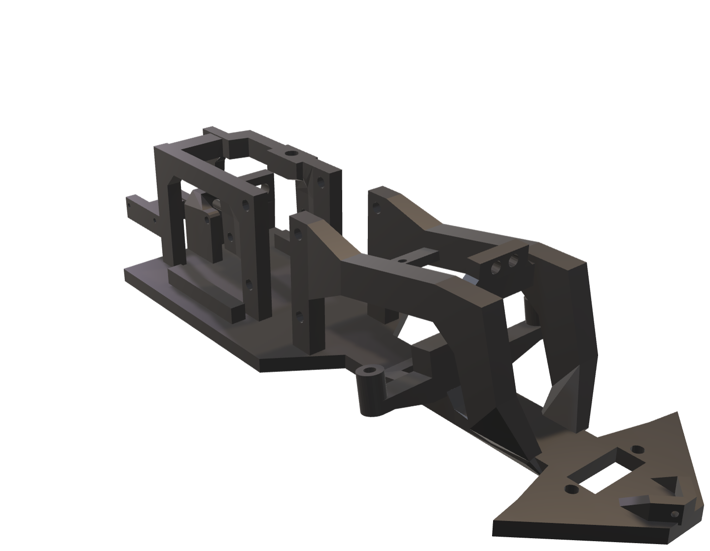
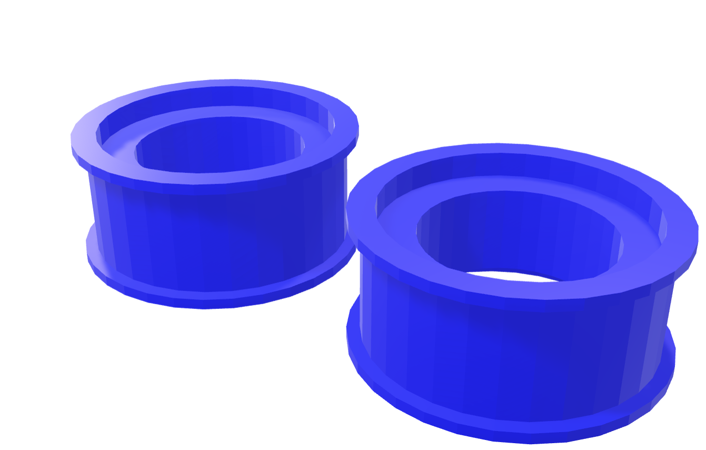
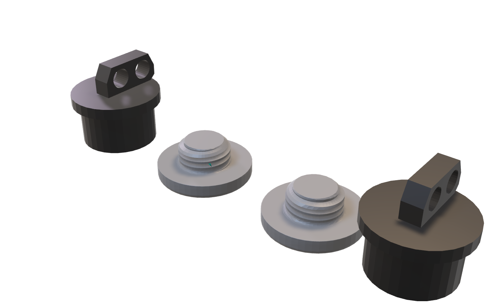
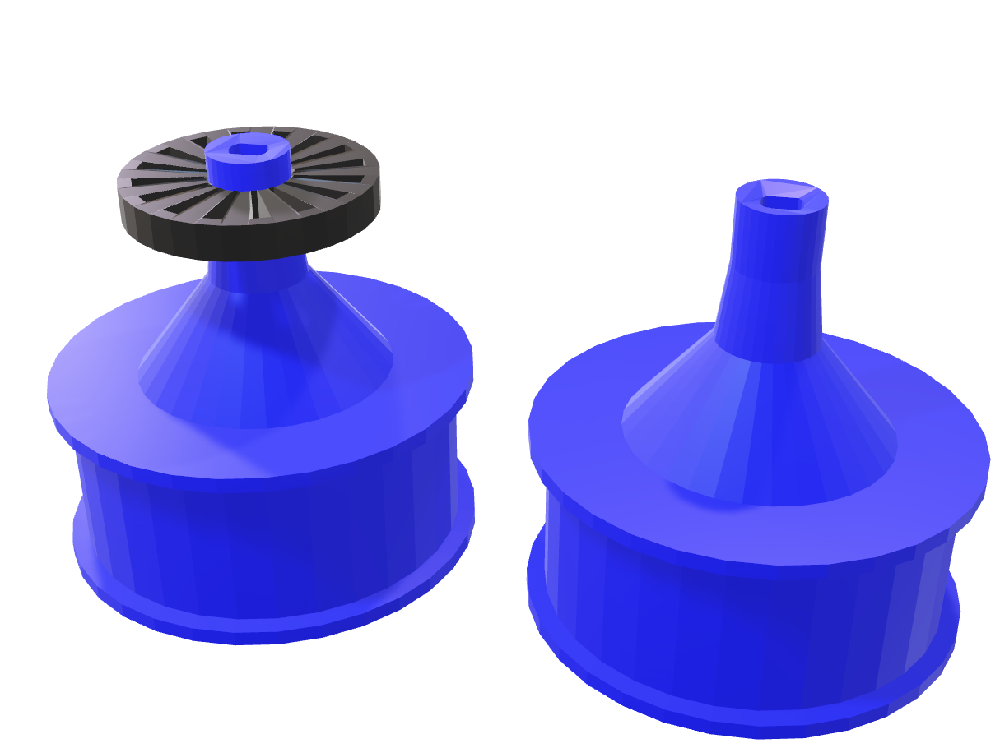
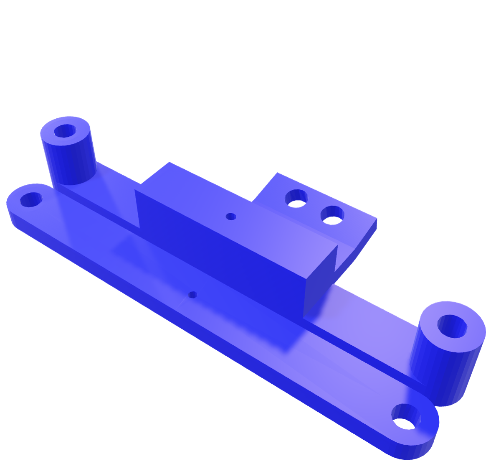

# 9. 3D Modeling and Mechanics

This section details the comprehensive approach to the mechanical design and fabrication of the VizDrive robot. Our methodology emphasizes precision, durability, and a lightweight structure.

## 9.1 3D Modeling Tool: Blender

We selected **Blender** as our primary 3D modeling software.

### Design Process in Blender

Our mechanical design workflow involved an iterative process:

1. **Conceptualization:** Initial sketches and rudimentary models were developed to define the robot's overall form factor and the preliminary placement of its components.
2. **Component Integration:** Detailed designs were created for mounts and enclosures, ensuring a perfect fit for all selected electronic components, including the Mega 2560 Pro (Embed), motor drivers, sensors, and battery.
3. **Structural Optimization:** Emphasis was placed on minimizing the robot's overall weight while maximizing its rigidity and structural strength. This involved applying techniques such as optimizing internal infill patterns during 3D printing.
4. **Iterative Refinement:** Physical prototypes were printed, their fit and function rigorously tested, and necessary design adjustments were iteratively made in Blender based on the empirical results.
5. **STL Export:** Finalized designs were exported as `.stl` files, the industry-standard format for 3D printing.

## 9.2 Mechanical Characteristics and Design Principles

The mechanical design of VizDrive is characterized by a focus on lightness, precision, and durability.

* **Light Frame:** The robot features a light beam chassis design, which efficiently compacts numerous components into a small footprint while maintaining high driving precision. This structural choice contributes to a durable yet lightweight robot.
* **Tolerance Management:** Component designs incorporated varied tolerances. For instance, screws were designed for a snug fit, whereas wheels and steering mechanisms were given more tolerance to allow for necessary movement and minimize friction. This strategic application of tolerance also provides a degree of suspension, enabling wheels to move vertically and offering flexibility and enhanced stability on minor ground deformities.
* **Caster Angle:** To mitigate imprecision resulting from high steering tolerances, a **10° caster angle** was implemented in the steering mechanism. This design ensures that the wheels naturally return to a position close to the center, facilitating precise straight-line movement.
* **Steering Angle:** The robot's steering system is engineered to achieve a **45-degree angle in each direction**, enabling sharp turns. This capability directly addresses complex maneuvers such as parallel parking, which are often part of the competition.
* **Screw Orientation:** Screws are specifically oriented to tighten during forward motion of the robot. This design detail prevents wheels from dislodging if excessive friction causes screws to loosen, ensuring continuous operation. The 3D files for the hubs include screw designs for both orientations to facilitate this.

## 9.3 3D Printing and Parameters

All custom mechanical parts for VizDrive were designed in Blender and fabricated using **PLA (Polylactic Acid)** filament via a **Creality Ender 3 3D printer**. PLA was selected for its ease of printing and sufficient strength for the application. While the following parameters are our standard settings, minor adjustments may be made for optimization.

### Chassis

* **Description:** The primary structural frame, designed to be lightweight yet rigid, providing essential mounting points for motors, sensors, and the main controller.
* **3D Model (STL):** [Chassis](./../models/chassis/chassis.stl)
* **Interactive 3D Model:** [Chassis Embed](https://vizdrive.github.io/VizDrive_WRO2025/embeds/interactive_chassis)
* **Printing Parameters:**
  * Infill Type: Honeycomb
  * Infill Density: 15%
  * Layer Height: 0.28mm
  * Nozzle Temperature: 200°C
  * Bed Temperature: 60°C
  * Print Speed: 150mm/s

### Front Wheel Rims

* **Description:** Custom-designed rims precisely shaped to fit into the wheel hubs.
* **3D Model (STL):** [Wheels](./../models/wheels/wheel_rims.stl)
* **Interactive 3D Model:** [Wheels Embed](https://vizdrive.github.io/VizDrive_WRO2025/embeds/interactive_rims)
* **Printing Parameters:**
  * Infill Type: Honeycomb
  * Infill Density: 20%
  * Layer Height: 0.28mm
  * Nozzle Temperature: 200°C
  * Bed Temperature: 60°C
  * Print Speed: 150mm/s

### Front Wheel Hubs with Screws

* **Description:** Hubs designed to connect directly to the steering rod, incorporating integrated screws to securely hold the wheels in place.
* **3D Model (STL):** [Wheel Hub](./../models/wheels/wheel_hub.stl)
* **Interactive 3D Model:** [Wheel Hub Embed](https://vizdrive.github.io/VizDrive_WRO2025/embeds/interactive_hub)
* **Printing Parameters:**
  * Infill Type: Honeycomb
  * Infill Density: 15%
  * Layer Height: 0.28mm
  * Nozzle Temperature: 200°C
  * Bed Temperature: 60°C
  * Print Speed: 150mm/s

### Encoder Wheel and Rear Wheel

* **Description:** A precisely designed wheel featuring 16 distinct markings or slots, intended for use with an optical encoder sensor to ensure accurate odometry (distance and speed measurement). A standard rear wheel without an encoder rim is also used.
* **3D Model (STL):** [Wheel Encoder](./../models/wheels/encoder_wheel.stl)
* **Interactive 3D Model:** [Encoder Wheel Embed]([.](https://vizdrive.github.io/VizDrive_WRO2025/embeds/interactive_rear_wheels))
* **Printing Parameters:**
  * Infill Type: Honeycomb
  * Infill Density: 20%
  * Layer Height: 0.28mm
  * Nozzle Temperature: 200°C
  * Bed Temperature: 60°C
  * Print Speed: 150mm/s

### Steering Rods and Camera Support

* **Description:** Components for the steering rods that connect to the wheels, along with a camera mount designed with a slight 15° pitch angle for optimal PixyCam positioning.
* **3D Model (STL):** [Steering Rods](./../models/steering/steering_rods.stl)
* **Interactive 3D Model:** [Steering Rods Embed](https://vizdrive.github.io/VizDrive_WRO2025/embeds/interactive_steering_rods)
* **Printing Parameters:**
  * Infill Type: Honeycomb
  * Infill Density: 15%
  * Layer Height: 0.28mm
  * Nozzle Temperature: 200°C
  * Bed Temperature: 60°C
  * Print Speed: 150mm/s

### 3D Printing Process

The fabrication process utilizing the Creality Ender 3 3D printer involved the following steps:

1. **Slicing:** STL models were converted into G-code (machine instructions) using Creality's slicer software. This step incorporates all specified printing parameters.
2. **Printing:** PLA filament was loaded, and the G-code was executed to build the parts layer by layer.
3. **Post-Processing:** Minimal post-processing was required for most components, primarily involving support material removal and light sanding to ensure aesthetic quality and a precise fit.

---

[Back to Main README.md Index](../README.md)
