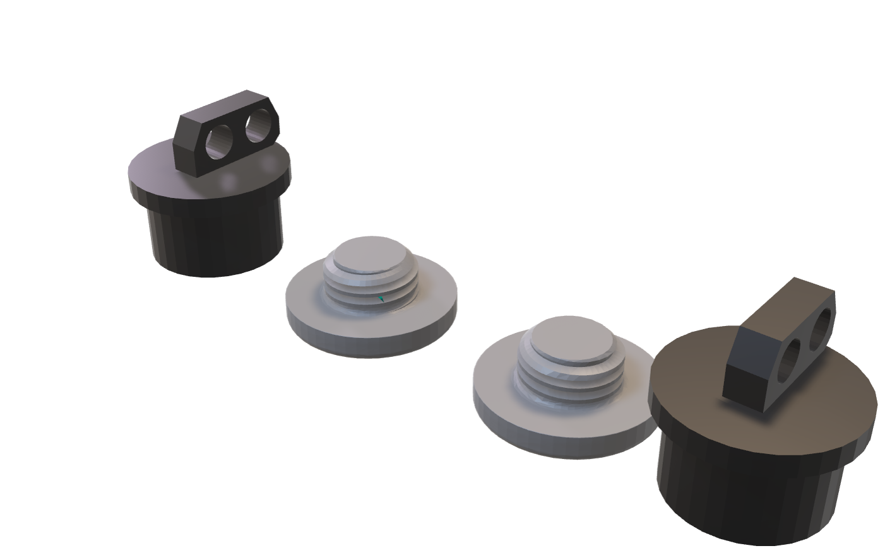
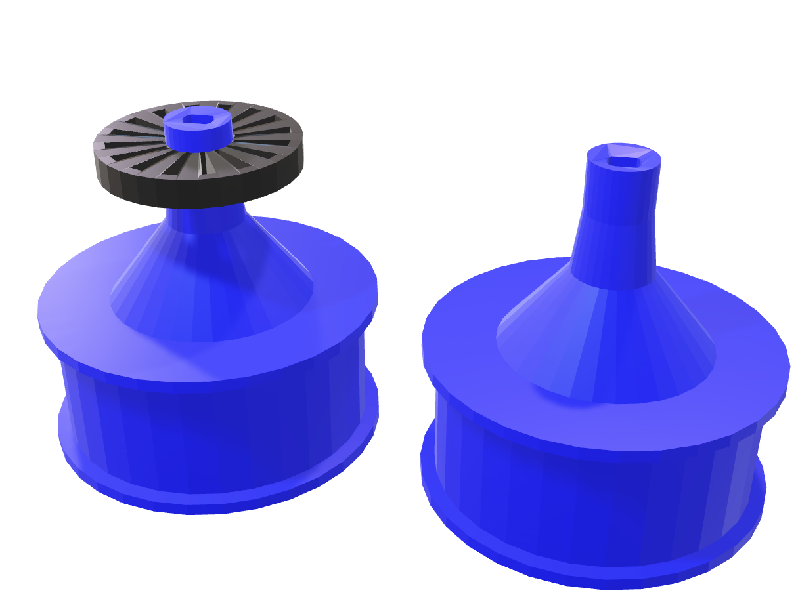
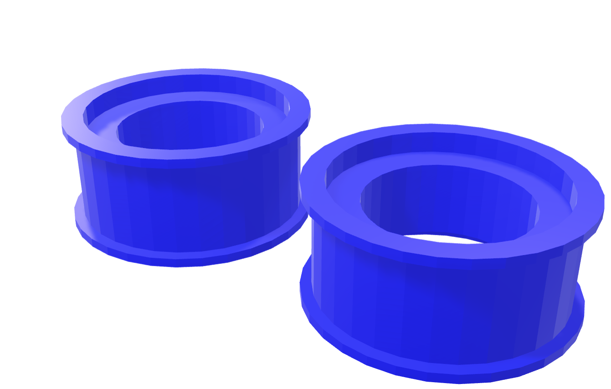

# Wheels Models

Here you can find all the .stl and .glb models of the wheels part of our robot.

The .glb models are used for the HTML embeds hosted in GitHub pages. 
We designed these embeds for a more interactive visualization of the models and their colors in the real-life robot. However, the .stl files can also be visualized directly in GitHub.

The designs included in this file directory are:

### 1. [Wheel Hubs](wheel_hub.stl)

Visit the embed: [Wheels Hub Embed](https://vizdrive.github.io/VizDrive_WRO2025/embeds/interactive_hub)

### 2. [Rear Wheels](encoder_wheel.stl)

Visit the embed: [Rear Wheels Embed](https://vizdrive.github.io/VizDrive_WRO2025/embeds/interactive_rear_wheels)

### 3. [Wheel Rims](wheel_rims.stl)

Visit the embed: [Wheel Rims Embed](https://vizdrive.github.io/VizDrive_WRO2025/embeds/interactive_rims)

---

For an explanation on the design and 3D printing of these and other models, refer to the document: [9. 3D Modeling](./../../docs/09_3d_modeling.md)
